<h1 align=center>Управление базами данных</h1>

>❗В данном лабораторном практикуме будут рассмотрены вопросы администрирования системы управления базами данных PostgreSQL.

***PostgreSQL** — это мощная, объектно-реляционная система управления базами данных (СУБД) с открытым исходным кодом. Она известна своей надежностью, соответствием стандартам и широким набором функций.*

---

## Основные характеристики PostgreSQL:

1.	**Объектно-реляционная СУБД:** поддерживает как реляционные (таблицы, строки, столбцы), так и объектно-ориентированные концепции (наследование, полиморфизм, пользовательские типы данных).

2.	**Открытый исходный код:** распространяется под свободной лицензией (BSD-like), что позволяет использовать, распространять и изменять ее без ограничений и платы.

3.	**Соответствие стандартам SQL:** поддерживает большую часть стандарта SQL, что обеспечивает переносимость между различными СУБД.

4.	**Транзакционная целостность:** гарантирует целостность данных с помощью ACID-транзакций (Atomicity, Consistency, Isolation, Durability).

5.	**Расширяемость:** предоставляет возможность расширения функциональности с помощью различных расширений (extensions), написанных на C, PL/pgSQL (процедурный язык PostgreSQL) и других языках. Существуют расширения для работы с географическими данными (PostGIS), полнотекстового поиска, работы с данными в формате JSON и многих других.

6.	**Поддержка различных типов данных:** поддерживает широкий спектр встроенных типов данных, включая числовые, текстовые, даты, время, массивы, JSON, геометрические типы и др.

7.	**Поддержка индексирования:** предоставляет различные типы индексов (B-tree, Hash, GiST, GIN, SP-GiST, BRIN) для ускорения выполнения запросов.

8.	**Репликация и высокая доступность:** поддерживает различные методы репликации (Streaming Replication, Logical Replication) для обеспечения высокой доступности и масштабируемости.

9.	**Поддержка параллельных запросов:** оптимизатор запросов может разделять сложные запросы на более мелкие подзадачи, которые выполняются параллельно, что повышает производительность.

10.	**Безопасность:** предоставляет различные механизмы для обеспечения безопасности данных, включая аутентификацию, авторизацию, шифрование и аудит.

11.	**Кроссплатформенность:** работает на различных операционных системах, включая Linux, Windows, macOS и BSD.

12.	**Активное сообщество:** имеет большое и активное сообщество пользователей и разработчиков, которое предоставляет поддержку и выпускает обновления.

 

## Где используется:

**PostgreSQL** используется в широком спектре приложений, включая:

- **веб-приложения:** хранение данных для веб-сайтов, интернет-магазинов, блогов и других веб-приложений;

- **геоинформационные системы (ГИС):** обработка и хранение географических данных с помощью расширения postgis;

- **финансовые приложения:** хранение и обработка финансовых данных;

- **научные исследования:** хранение и анализ больших объемов данных;

- **ERP-системы:** хранение данных для систем управления ресурсами предприятия;

- **CRM-системы:** хранение данных для систем управления взаимоотношениями с клиентами.

---

## Работа с PostgreSQL

Работа с PostgreSQL будет выполняться с помощью **pgAdmin 4**. 

***pgAdmin 4** – это **ведущий** графический инструмент управления с открытым исходным кодом для администрирования, разработки и управления СУБД PostgreSQL.*

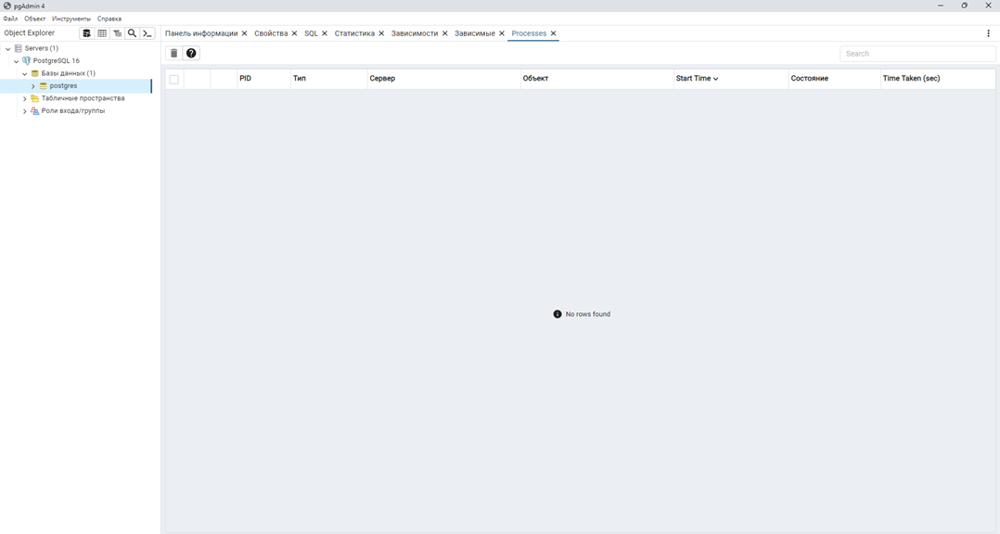

 

### Начало работы

Для начала работы, запустим pgAdmin 4.

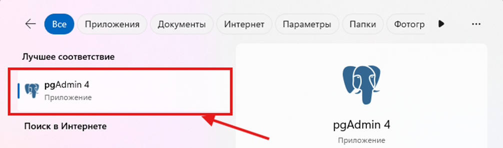

#### Создание БД
Сначала необходимо научиться создавать **базы данных**. Используя графический интерфейс, создадим базу данных, нажав правой кнопкой мыши (`ПКМ`) на раздел **«Базы данных»**, затем **«Создать»** и **«База данных…»**.

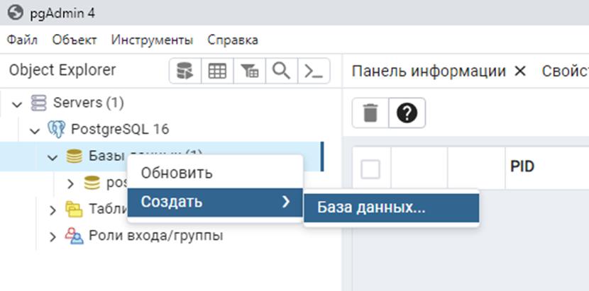

 

В окне создания базы данных расположено 6 вкладок: 
- «Общие» 
- «Определение»
- «Безопасность»
- «Параметры»
- «Дополнительно»
- «SQL».

На вкладке **«Общие»** (или «General») расположены следующие поля: 
- База данных (в данном поле записывается название базы данных)

- OID (уникальный идентификатор объекта, который используется в PostgreSQL для различения объектов в базе данных)
- Владелец (указывается пользователь, который будет владеть базой данных)
- Комментарии (заметки о базе данных).
  
> 📗 Пользователи могут указать значение больше 16383 в OID. Эта опция доступна начиная с версии 15 и выше

 

Заполним поле «База данных». 
- Название базы данных **«TestDB»**. 
- **OID** может заполняться автоматически, также можно вручную. Для данного задания нет необходимости заполнять данное поле вручную – оставим его пустым. 
- Поле **«Владелец»** также не будем изменять, так как мы не создавали других пользователей (пользователь **«postgres»** — это предустановленный суперпользователь в системе управления базами данных PostgreSQL. Он создается автоматически при установке PostgreSQL и имеет полные права на все базы данных и объекты в системе). 
- Поле **«Комментарии»** также оставим пустым.

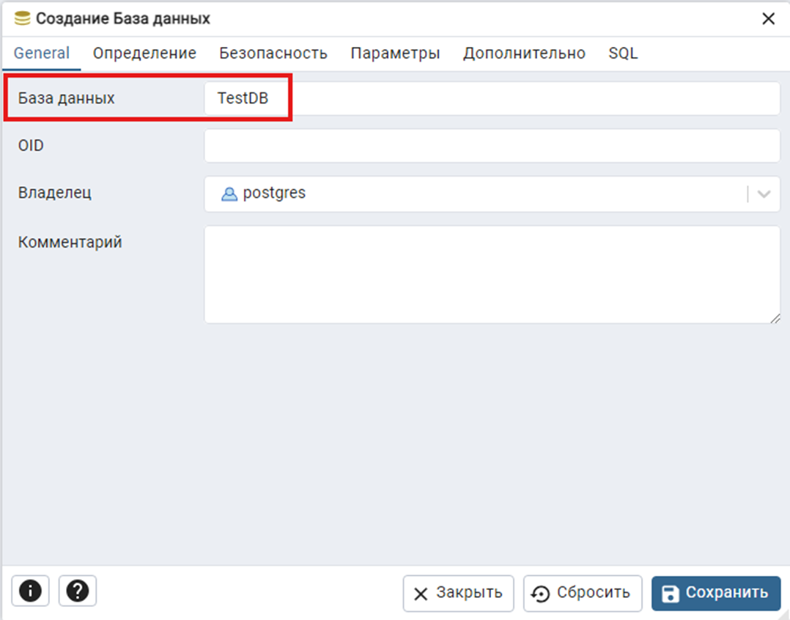

 

> 📗 Справку по объектам интерфейса можно открыть, нажав на кнопки, расположенные в левом нижнем углу окна 

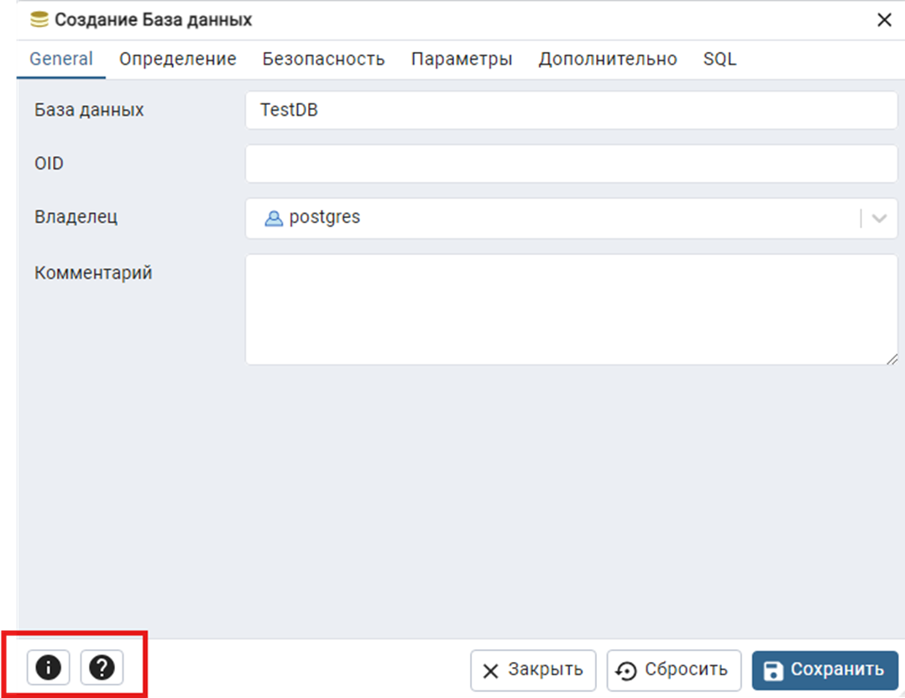

> ❗ **Изучите** вкладки «Определение», «Безопасность», «Параметры», «Дополнительно» и «SQL», используя справку.

Их оставим без изменений и нажмем на кнопку «Сохранить». Как можно заметить, в окне объектов появилась база данных «TestDB» и все ее объекты.

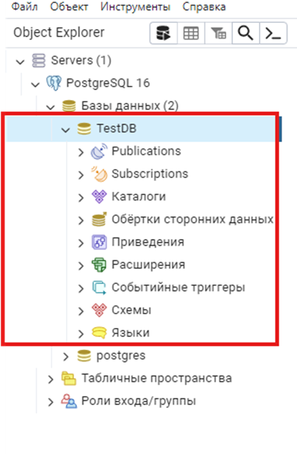

 

#### Что внутри
Рассмотрим каждое диалоговое окно из выпадающего списка базы данных.

1. **«Публикации»** - используется для управления публикациями в системе управления базами данных PostgreSQL. **Публикации** – это механизм, позволяющий определить набор изменений данных (вставки, обновления, удаления), которые **должны быть реплицированы** на другие базы данных;

**Репликация** — это процесс копирования и поддержания данных в нескольких базах данных или на разных серверах, чтобы обеспечить доступность, надежность и отказоустойчивость. 
Она используется для обеспечения целостности данных и их резервирования. В контексте систем управления базами данных (СУБД) репликация может быть реализована разными способами, в зависимости от потребностей и требований.

##### Виды репликаций

- **Синхронная репликация.** Данные копируются на вторичный сервер сразу же после их изменения на первичном сервере. **Обеспечивает высокую степень согласованности данных**, но может замедлить выполнение операций записи, так как запрос должен ожидать подтверждения от всех реплик.

- **Асинхронная репликация.** Данные копируются на вторичный сервер с некоторой задержкой, что позволяет основному серверу продолжать работу без ожидания подтверждения. Это **повышает производительность записи**, но может привести к несоответствию данных между серверами на момент чтения.

- **Логическая репликация.** Позволяет реплицировать определенные изменения в конкретных таблицах или строках. Это **позволяет гибко управлять данными**, выбирая, какие данные будут синхронизироваться между источником и получателем. Подходит для распределенных систем и приложений, где требуется выборочная репликация.

- **Физическая репликация.** Копирует всю базу данных или её части на уровне блоков. Этот метод чаще всего используется **для создания резервных копий и восстановления**.

 

2. **«Подписки»** - используется для управления подписками на публикации в PostgreSQL. Подписка представляет собой настройку, которая позволяет получать данные из определенной публикации в другой базе данных. Это важный аспект логической репликации, позволяющий синхронизировать данные между различными серверами PostgreSQL.
3. **«Каталоги»** - предоставляет пользователям возможность управлять и просматривать каталоги в PostgreSQL. Каталоги в PostgreSQL — это специальные схемы, которые содержат метаданные о базе данных, включая информацию о таблицах, индексах, функциях и других объектах базы данных.

> `pg_catalog` - основной каталог, который содержит системные таблицы и представления, необходимые для работы системы.
> 
> `information_schema` - стандартный каталог, который предоставляет доступ к метаданным о базе данных, совместимый с SQL стандартами.

4. **«Обёртки сторонних данных»** - предназначена для управления обертками, которые позволяют PostgreSQL взаимодействовать с данными из внешних источников. Это может быть полезно для работы с данными, хранящимися в других базах данных или даже в файлах, предоставляя возможность выполнять запросы к ними так, как если бы они были частью локальной базы данных.
   
4.	**«Приведения»** - используется для управления коллациями в PostgreSQL. Коллация определяет, как строки сравниваются и сортируются в базе данных. Это особенно важно при работе с текстовыми данными, так как разные языки и регионы могут иметь свои правила сортировки и сравнения.
5.	**«Расширения»** - используется для управления расширениями в PostgreSQL. Расширения позволяют добавлять дополнительные функции, типы данных, индексы и другие возможности, которые не входят в стандартную сборку PostgreSQL. Это делает систему более гибкой и позволяет адаптировать её под конкретные требования приложений и пользователей.
6.	**«Событийные триггеры»** - позволяет управлять событиями, которые происходят в базе данных PostgreSQL. Событийные триггеры предназначены для обработки изменений на уровне схемы базы данных, таких как создание или изменение объектов (таблиц, представлений и т. д.). Это полезно для обеспечения контроля над структурными изменениями базы данных, автоматизации задач или реализации логирования.
7.	**«Схемы»** - позволяет управлять схемами в выбранной базе данных PostgreSQL. Схема является контейнером для объектов базы данных, таких как таблицы, представления, индексы, последовательности и другие объекты. Схемы помогают организовать и структурировать базу данных, обеспечивая удобство и безопасность. С помощью справки изучите все объекты в данной вкладке.
8.	**«Языки»** - позволяет управлять языками процедурного программирования, поддерживаемыми PostgreSQL. Языки используются для написания хранимых процедур, функций и триггеров в базе данных. В PostgreSQL по умолчанию доступны несколько языков, таких как: 
    - PL/pgSQL 
    - PL/Python 
    - PL/Perl 
    - и другие.

 

#### Графическое создание таблиц

Для того, чтобы создать таблицу в базе данных, используя графический интерфейс, необходимо раскрыть вкладки **«Схемы»**, затем **«public»** и правой кнопкой мыши нажать на **«Таблицы»**. В списке выбрать **«Создать»**, **«Таблица…»**

    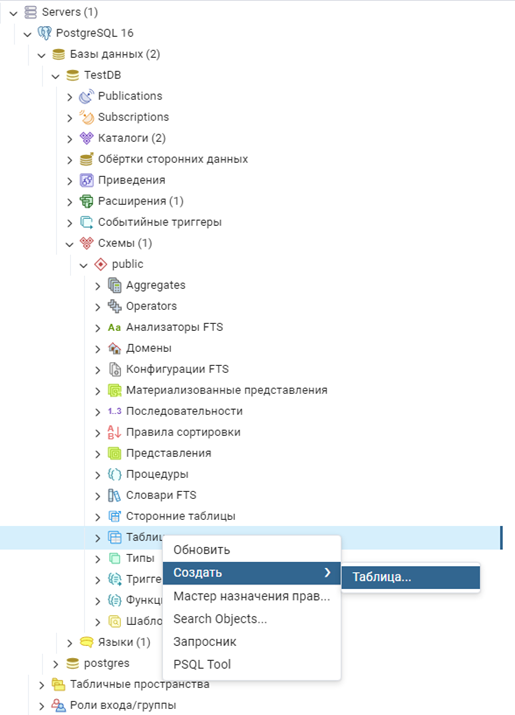

 

В первой вкладке присвоим название таблице **«TestTable»** 

    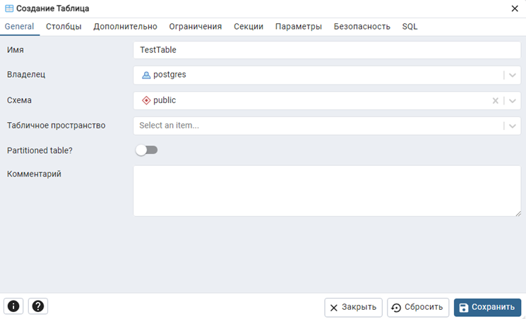

 

Для создания столбцов перейдем во вкладку **«Столбцы»**. В правой части окна нажмем на кнопку **«Add** row».

    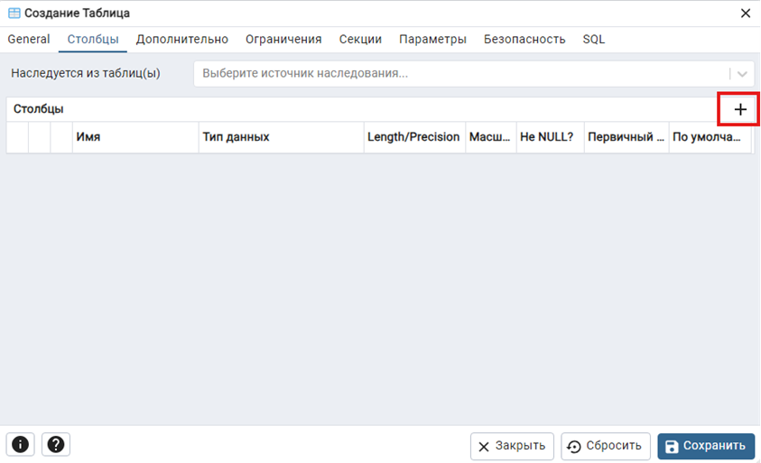

 

Создайте 2 столбца **«id»** и **«Name»** с ограничениями. И нажмите **«Сохранить»**.

    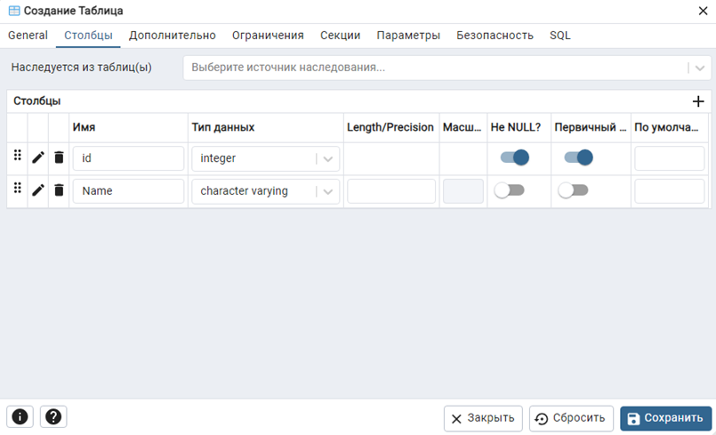

 

Если все сделано верно, то таблица должна **отобразиться в списке**.

    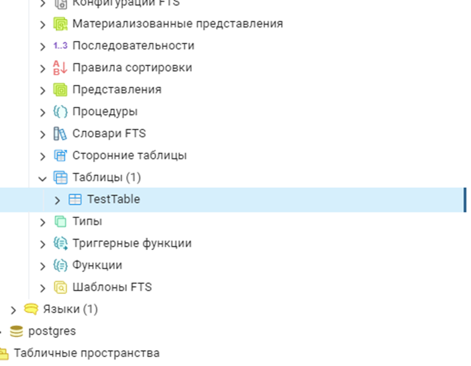

 

#### Резервные копии

##### Создание

Создадим резервную копию базы данных **«TestDB»**. Для этого нажимаем на нее правой кнопкой мыши, **«Резервная копия…»**

    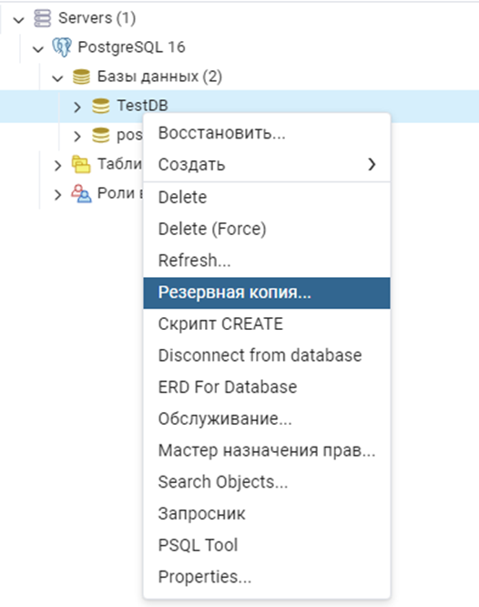

 

Сохраним резервную копию базы данных в свою папку. 
Перед этим **изучите** содержимое остальных вкладок в открывшемся окне.

    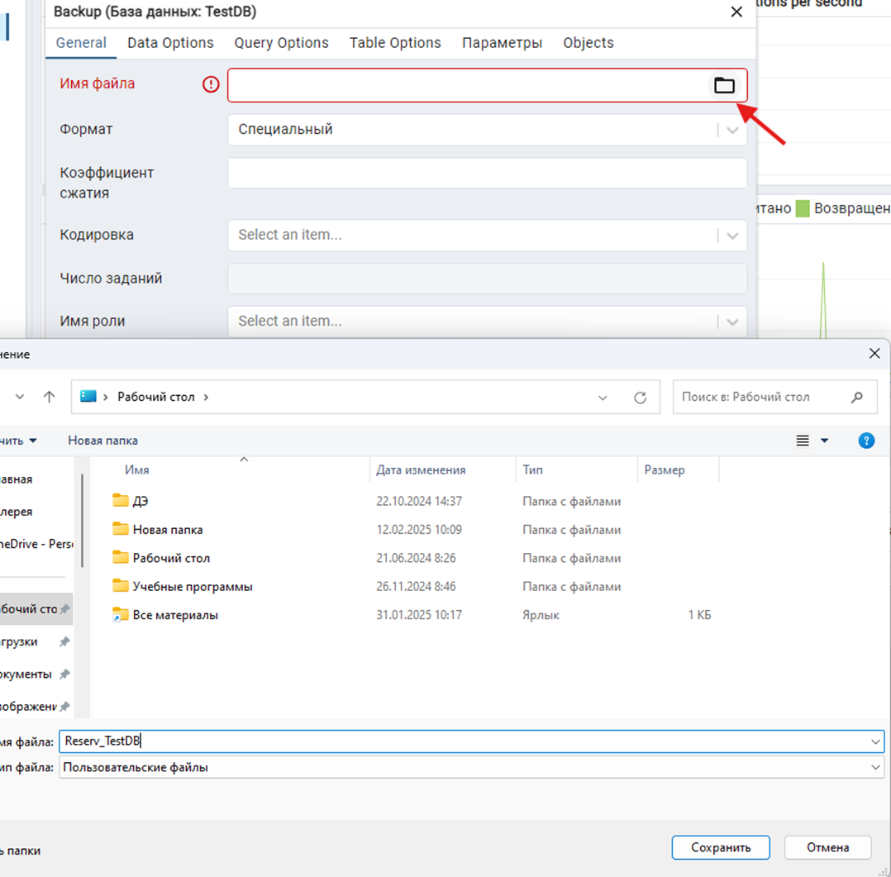

 

Если все прошло успешно, то появятся **уведомления**. 
**Проверьте** наличие файла резервной копии базы данных в Вашей папке.

    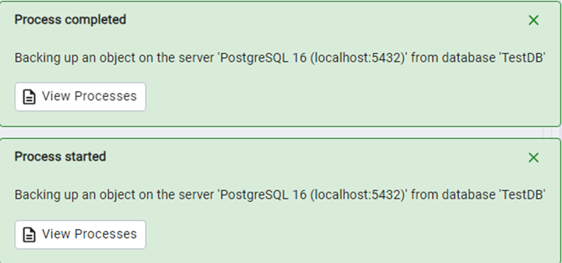

    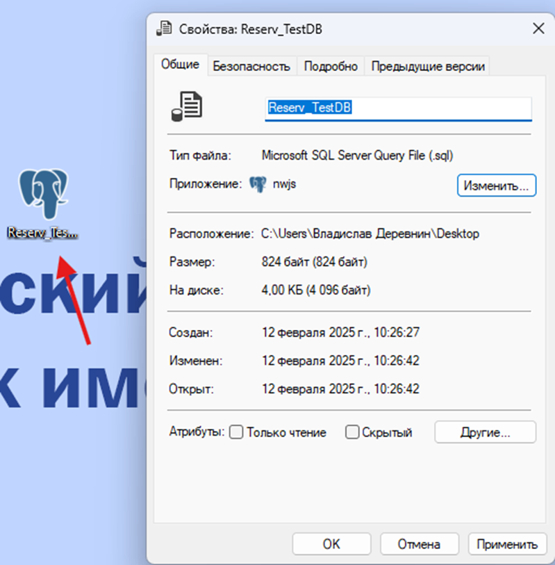

##### Использование

Чтобы восстановить базу данных из данного файла необходимо нажать правой кнопкой мыши на базу данных (это может быть новая пустая база данных или старая, в зависимости от ситуации) и выбрать **«Восстановить…»**. В открывшемся окне в строке **«Имя файла»** выбираем ранее созданный файл и нажимаем **«Восстановить»**.

    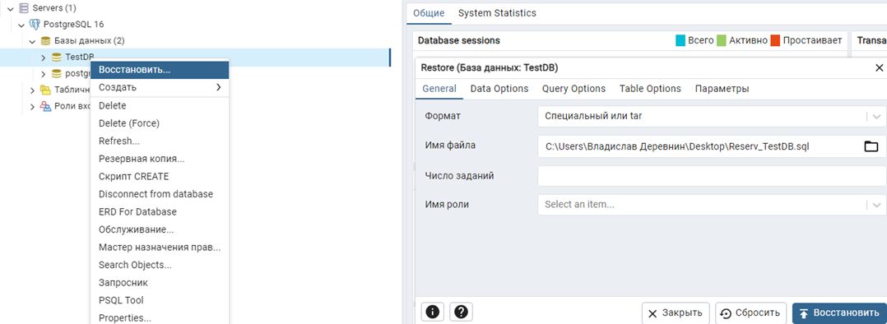

> ❗ После процесса восстановления должны появиться уведомления.

#### Удаление таблицы

Чтобы удалить созданную таблицу **«TestTable»**, нажмем на нее правой кнопкой мыши, затем **«Delete»**.

    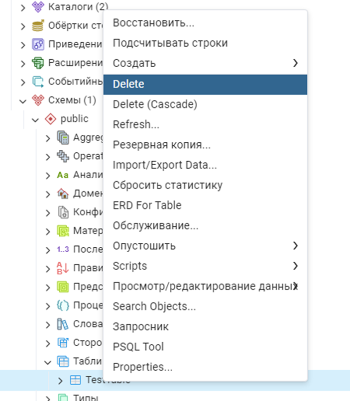

> ❗ База данных удаляется аналогично