<h1 align=center>Управление схемами и таблицами</h1>

> ❗ В лабораторном практикуме будет использоваться база данных `«Склад»`. Ниже представлено описание предметной области данной базы данных.

В системе управления складом основное внимание уделяется **эффективному** управлению запасами товарных единиц. Эта система необходима для обеспечения точности учета товаров, мониторинга их состояния и управления потоками материалов, что особенно важно для повышения эффективности бизнеса.

## Описание системы

### Основные цели системы:

1. **Учет запасов:** Поддержка актуальной информации о количестве и состоянии товаров на складе.
2. **Оптимизация процессов:** Упрощение логистических процессов, таких как приемка, хранение, перемещение и отгрузка товаров.
3. **Повышение точности:** Снижение ошибок при обработке заказов и инвентаризации.
4. **Анализ данных:** Предоставление отчетов и аналитики по запасам, продажам и поставкам для принятия более обоснованных управленческих решений.

### Ключевые сущности и их атрибуты

**Товар:**
-	**ID:** Уникальный идентификатор товара (INTEGER, PRIMARY KEY, GENERATED BY DEFAULT AS IDENTITY);
-	**Название:** Полное название товара, которое поможет его идентифицировать (VARCHAR (50), NOT NULL, UNIQUE);
-	**Категория:** Классификация товара (например, электроника, одежда, продукты питания) (VARCHAR (50), NOT NULL);
-	**Единица измерения:** Указание, в каких единицах измеряется товар (например, шт., кг, литр) (VARCHAR (10), NOT NULL);
-	**Количество на складе:** Текущее количество товара, доступного для продажи или использования (INTEGER, NOT NULL, Проверка: (Количество_на_складе>= 0));
-	**Цена за единицу:** Стоимость одной единицы товара, которая может изменяться в зависимости от рыночной ситуации (DECIMAL (10, 2), NOT NULL, Проверка: (Цена_за_единицу>= 0));
-	**Описание:** Дополнительная информация о товаре, включая характеристики и особенности (VARCHAR (255)).

<br>

**Поставщик:**
-	**ID:** Уникальный идентификатор поставщика (INTEGER, PRIMARY KEY, GENERATED BY DEFAULT AS IDENTITY);
-	**Название:** Наименование компании-поставщика (VARCHAR (50), NOT NULL, UNIQUE);
-	**Контактное лицо:** Имя и фамилия лица, ответственного за взаимодействие с поставщиком (VARCHAR (255), NOT NULL);
-	**Телефон:** Контактный номер телефона для связи (VARCHAR (20), NOT NULL, UNIQUE);
-	**Адрес:** Физический адрес поставщика, который может использоваться для доставки товаров (VARCHAR (255), NOT NULL);
-	**Email:** Электронная почта для оперативного общения (VARCHAR (50) NOT NULL).

<br>

**Заказ:**
-	**ID:** Уникальный идентификатор заказа (INTEGER, PRIMARY KEY, GENERATED BY DEFAULT AS IDENTITY);
-	**Дата заказа:** Дата, когда был создан заказ (DATE, NOT NULL);
-	**ID_поставщика:** Ссылка на идентификатор поставщика, у которого был сделан заказ (INTEGER, NOT NULL, Связь с Поставщик (id_Поставщика));
-	**Статус:** Текущий статус заказа (VARCHAR (20), NOT NULL, Проверка:(Значения: 'Ожидается', 'Выполнен', 'Отменен'));
-	**Общая сумма:** Общая стоимость всех товаров в заказе (DECIMAL (15, 2), NOT NULL, Проверка: (Общая_сумма >= 0));

<br>

**Заказанный товар:**
-	**ID:** Уникальный идентификатор записи о заказанном товаре (INTEGER, PRIMARY KEY, GENERATED BY DEFAULT AS IDENTITY);
-	**ID_заказа:** Ссылка на идентификатор заказа, к которому относится данный товар (INTEGER, NOT NULL, Связь с Заказ(id_Заказа));
-	**ID_товара:** Ссылка на идентификатор товара (INTEGER, NOT NULL, Связь с Товар(id_Товара));
-	**Количество:** Количество единиц товара, заказанных в рамках заказа (INTEGER, NOT NULL, Проверка:(Количество > 0)).

<br>

**Перемещение:**
-	**ID:** Уникальный идентификатор записи о перемещении товара (INTEGER, PRIMARY KEY, GENERATED BY DEFAULT AS IDENTITY);
-	**ID_товар:** Ссылка на идентификатор товара, который перемещается (INTEGER, NOT NULL, Связь с Товар(id_Товара));
-	Дата перемещения: Дата, когда было осуществлено перемещение (DATE, NOT NULL);
-	**Количество:** Количество единиц товара, которые были перемещены (INTEGER, NOT NULL, Проверка: (Количество > 0));
-	**Исходное местоположение:** Место, откуда товар был перемещен (VARCHAR(255), NOT NULL);
-	**Новое местоположение:** Место, куда товар был перемещен (VARCHAR(255) NOT NULL).

<br>

### Взаимодействия между сущностями

`Поставщик ---> Заказ` - Поставщик может генерировать множество заказов. Каждый заказ связан только с одним поставщиком.

`Заказанный товар ---> Товар` - Каждый заказанный товар соответствует одному конкретному товару, но один товар может быть частью множества различных заказов.

`Товар ---> Перемещение` - Товар может перемещаться между различными местоположениями на складе, создавая записи о перемещении. Одно перемещение может касаться только одного товара, но одно и то же местоположение может быть связано со множеством записей о перемещениях разных товаров.

<div align=center>
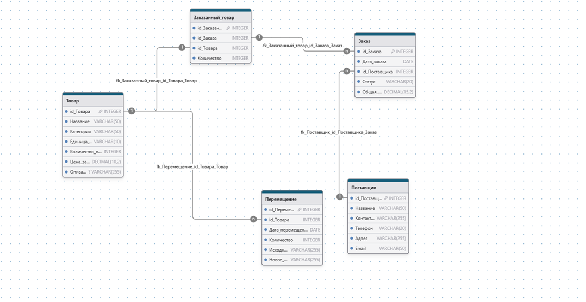
</div>

<br>

## Создание системы

Создадим базу данных `«Склад»`, затем, нажав на нее правой кнопкой мыши выбрать **«Запросник»**. И выполним запрос. После выполнения данного запроса будут созданы 3 таблицы: `«Товар»`, `«Поставщик»` и `«Заказ»`. 
> ❗ Обратите внимание на ограничения!

<div align=center>

</div>

В каждой таблице имеются идентификаторы (например, в таблице `«Товар»` — это `«id_Товара»`). Данные поля предназначены для уникальной идентификации записей в таблицах. 

У этих полей имеются следующие ограничения: 
1.	**PRIMARY KEY** – данное поле будет ключевым (этот параметр делает каждое значение этого поля уникальным, и именно благодаря ему будет происходить уникальная идентификация записей);
2.	**GENERATED BY DEFAULT AS IDENTITY** – автоматическая нумерация строк (столбец с автоинкрементными значениями).

Также в таблицах присутствуют другие ограничения: 

- **CHECK** – проверка соответствия заданному условию 
  - например, в таблице `«Товар»` столбец `«Количество_на_складе»` должен иметь значение большему, либо равному 0; 
  - или в таблице `«Заказ»` столбец `«Статус»` может быть занесено только одно из трех значений: `«Ожидается»`, `«Выполнен»` или `«Отменен»`). 
  
- **UNIQUE** – проверка уникальности значения в столбце, то есть значения в данном столбце не могут повторяться.

- **FOREIGN KEY** - это столбец или столбцы, которые ссылаются на первичный ключ другой таблицы. Он нужен для того, чтобы связать две разные таблицы между собой. 
  - В таблице `«Заказ»` столбец `«id_Поставщика»` ссылается на ключевое поле в таблице `«Поставщик»`. Значения в данном поле не должны противоречить значениям одноименного поля из таблицы `«Поставщик»`.


> ❗ Все имеющиеся типы данных изучите на официальном сайте PostgreSQL https://www.postgresql.org/docs/current/datatype.html . 
> 
> В нашем случае изучите следующие типы данных: **INTEGER**, **VARCHAR**, **DECIMAL**, **DATE**.


<br>


После завершения запроса, должно отобразиться сообщение. 
Данное сообщение информирует о том, что запрос выполнен успешно.

<div align=center>
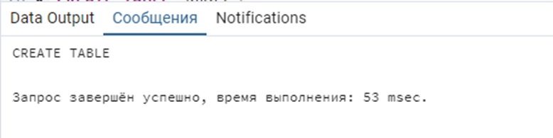
</div>

<br>

**Исходя из описания предметной области, создайте оставшиеся таблицы.** 

После создания таблиц раскройте вкладку **«Схемы»**, **«Таблицы»** и убедитесь, что все таблицы созданы.

<div align=center>
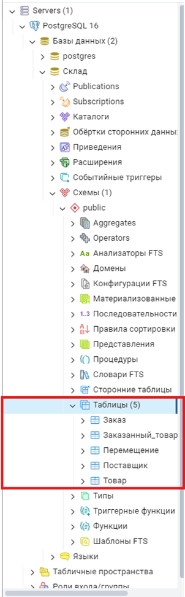
</div>

<br>

## Заполнение системы

Добавим данные в таблицу `«Товар»`. 
Для этого создадим запрос. 

<div align=center>
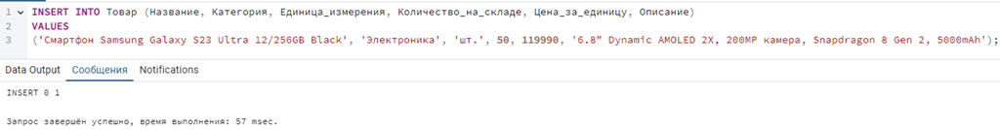
</div>

``` SQL
📗 Памятка
INSERT INTO Таблица (Столбец) 
VALUES ('Значение1'), ('Значение2');
```

Конструкция **INSERT INTO** отвечает за добавление данных в таблицу: 

сначала необходимо написать ту таблицу, в которую добавляются данные, затем в скобках перечислить столбцы, в которые нужно добавить данные. После этого написать ключевое слово **VALUES** и в скобках перечислить те значения, которые требуется добавить (обратите внимание, что текстовые значения пишутся в одинарных ковычках). Если требуется добавить несколько строк, то после закрытия скобки, где перечисляются данные, необходимо поставить запятую `,` и в скобках перечислить значения второй строки и т.д. Когда требуется завершить процесс добавления, в конце нужно поставить `;`  

В нашем примере добавлена одна строка. Также обратите внимание на то, что первое поле `id_Товара` не заполняется. 

> ❓ **Объясните почему его не нужно вписывать в конструкцию INSERT INTO?**

<br>

Убедимся, что данные добавлены. 
Для этого выполним запрос. 

<div align=center>
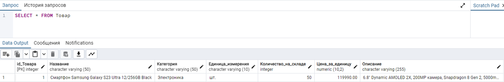
</div>

``` SQL
📗 Памятка
SELECT Столбец FROM Таблица
```

Конструкция **SELECT** отвечает за выборку данных. 

В нашем случае мы выводим все данные, поэтому после ключевого слова **SELECT** пишется `*` (это значит, что выводятся данные из всех столбцов). После **FROM** пишется название таблицы.


<br>

Изменим размер поля `«Название»` в таблице `«Товар»` с 50 символов на 100. 
Для этого в списке с таблицами нажмем на таблицу «Товар» правой кнопкой мыши и выберем «Properties…». В разделе «Столбцы» изменим значение «Length/Precision» у столбца «название» с 50 на 100.

<div align=center>
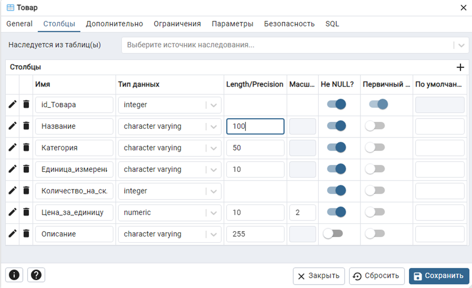
</div>

<br>

### Заполните самостоятельно

Заполните все имеющиеся таблицы. Все данные представлены ниже.

<div align=center>
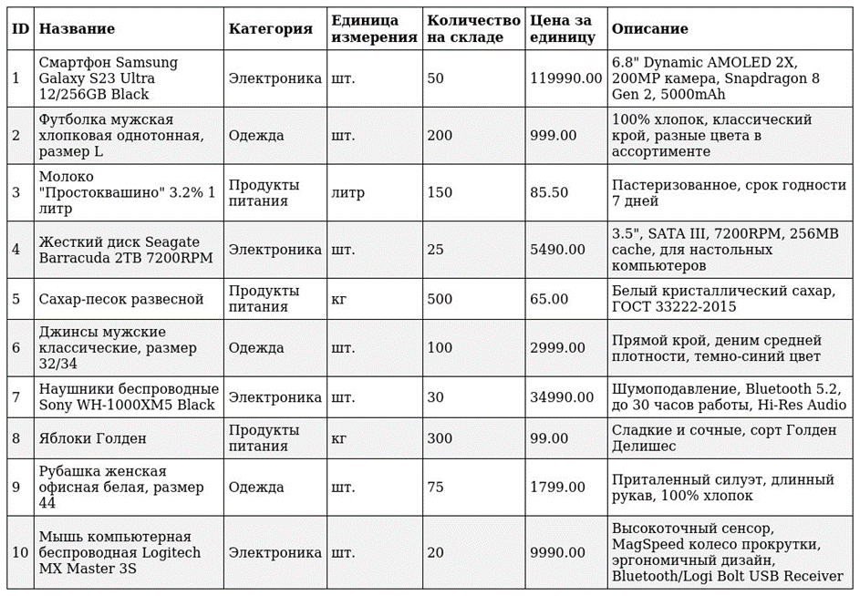
</div>

> Данные для таблицы `Товар`

<br>

<div align=center>
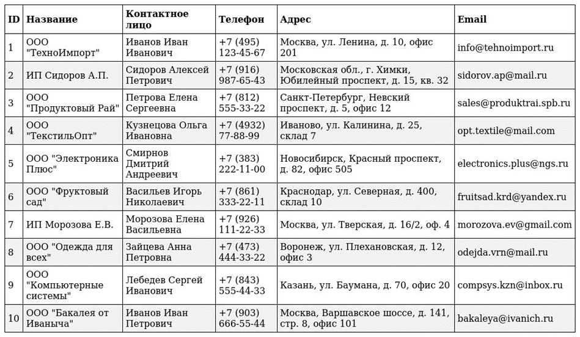
</div>

> Данные для таблицы `Поставщик`

<br>

<div align=center>
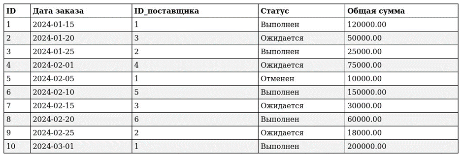
</div>

> Данные для таблицы `Заказ`

<br>

<div align=center>
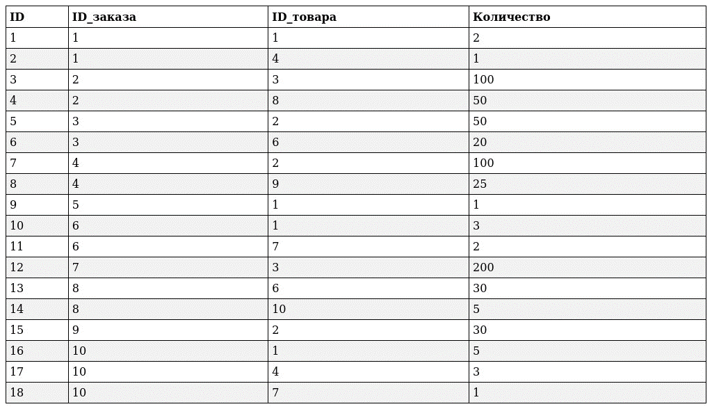
</div>

> Данные для таблицы `Заказанный товар`

<br>

<div align=center>
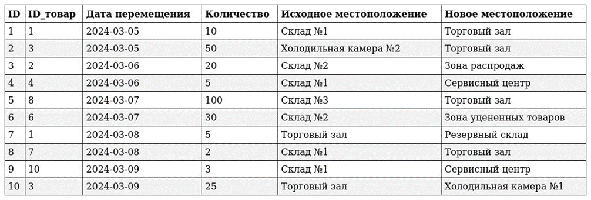
</div>

> Данные для таблицы `Перемещение`

<br>

## Экспорт данных

Следующим этапом выполним экспорт данных. Экспортируем таблицу `«Заказы»` в свою папку. Данные будут скопированы в файл `Заказы.csv`.

***CSV** — текстовый формат для представления табличных данных. Строка таблицы соответствует строке текста, которая содержит одно или несколько полей, разделённых запятыми.*

<div align=center>
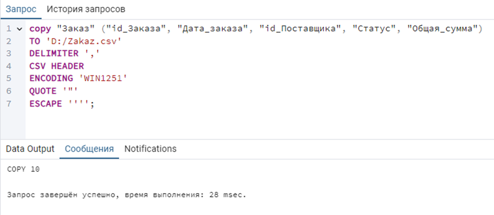
</div>

**Объяснение запроса:**
- **copy** - это команда PostgreSQL, используемая для копирования данных в файлы и из базы данных.
- **"Заказ"** - ссылается на таблицу `Заказ` в схеме public.
- **("id_Заказа", "Дата_заказа", "id_Поставщика", "Статус", "Общая_сумма")** - указывает столбцы, которые будут экспортированы.
- **TO 'D:/Zakaz.csv'** - Путь к выходному файлу CSV.
- **DELIMITER ','** - устанавливает запятую как разделитель.
- **CSV HEADER** - включает названия столбцов в первую строку CSV.
- **ENCODING 'WIN1251'** - указывает кодировку WIN1251 для выходного файла.
- **QUOTE '"'** - определяет символ кавычек для строковых полей.
- **ESCAPE ''''** - устанавливает управляющий символ для одинарных кавычек.

После выполнения запроса в папке, указанной выше, появится файл с названием `Zakaz`. Запустите файл. Убедитесь, что данные экспортировались.

<div align=center>
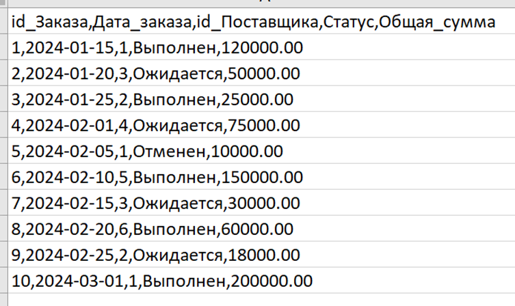
</div>

> **Самостоятельно экспортируйте 2 любые таблицы.**

<br>

## Импорт данных

Выполним импорт данных в таблицу `«Заказанный_товар»`. 
Для этого создадим файл Excel и сохраним его в формате CVS (разделитель – запятая). Название файла «Zakaz_tovar». В нем будут храниться данные для импорта в базу данных.

<div align=center>
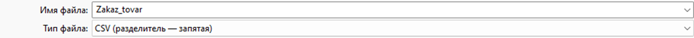
</div>

1. Откройте файл и заполните его содержимым. **Обратите внимание**, что все записано в ОДНОМ столбце. В первой строке написаны названия столбцов таблицы `«Заказанный_товар»` за исключением ключевого поля, так как он заполняется автоматически.
     <div align=center>
     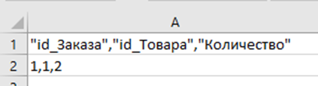
     </div>
2. Закройте файл.

<br>

Напишем запрос
<div align=center>
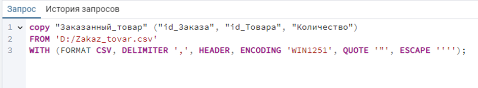
</div>

**Объяснение запроса:**
- **copy** -  это мета-команда, специфичная для утилиты psql (командной строки PostgreSQL). Она используется для быстрого импорта данных из файла в таблицу (или экспорта данных из таблицы в файл). Важно помнить, что это не стандартный SQL запрос.
- **"Заказанный_товар"** - это имя таблицы, в которую будут импортированы данные.
- **"id_Заказанного_товара", "id_Заказа", "id_Товара", "Количество"** - это имена столбцов. Опять же, двойные кавычки используются для обработки имен столбцов, содержащих специальные символы или требующих сохранения регистра. Порядок следования колонок должен совпадать с порядком столбцов в CSV файле.
- **FROM 'D:/Zakaz_tovar.csv'** - это указывает на путь к файлу CSV, из которого будут считаны данные.
- **WITH (FORMAT CSV, DELIMITER ',', HEADER, ENCODING 'WIN1251', QUOTE '"', ESCAPE ''')** - это список опций, которые определяют формат данных в файле CSV.
  - **FORMAT CSV** - указывает, что файл имеет формат CSV (Comma Separated Values - значения, разделенные запятыми).
  - **DELIMITER ','** - указывает, что запятая `,` используется в качестве разделителя между полями в файле CSV.
  - **HEADER** - указывает, что первая строка файла содержит заголовки столбцов. Эти заголовки будут использованы для сопоставления данных со столбцами в таблице.
  - **ENCODING 'WIN1251'** - указывает, что файл закодирован в кодировке WIN1251. Это важно указать правильно, чтобы символы в файле (особенно русские буквы) были интерпретированы корректно.
  - **QUOTE '"'** - указывает, что двойные кавычки `"` используются для заключения полей, содержащих запятые или другие специальные символы.
  - **ESCAPE '''"** - указывает, что одинарная кавычка `'` используется в качестве escape-символа. Escape-символ используется для экранирования специальных символов внутри полей, заключенных в кавычки. Например, если поле содержит двойную кавычку, ее можно экранировать с помощью escape-символа. Так как сам escape-символ должен быть внутри строки, то его нужно экранировать.

<br>

После выполнения запроса для импорта, убедимся, что данные добавились в таблицу «Заказанный_товар». Для этого выполним запрос на выборку данных.

<div align=center>

</div>

> **Самтостоятельно Импортируйте данные в 2 любые таблицы (2-3 строки).**