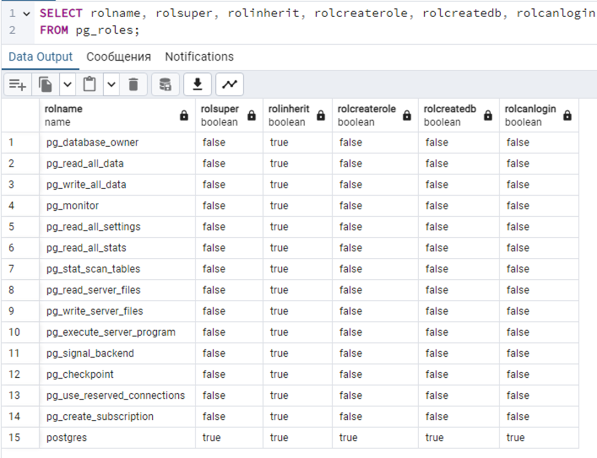
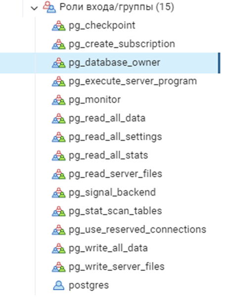
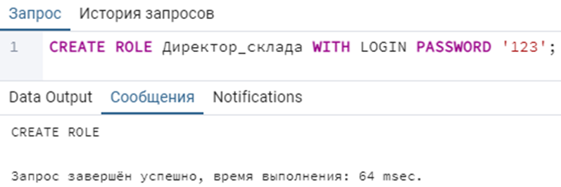
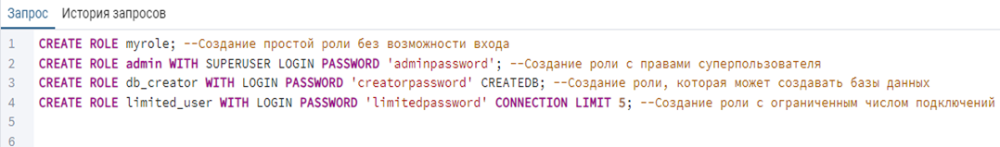

<h1 align=center>Управление пользователями и ролями</h1>

> ❗ Данная лабораторная работа посвящена изучению основ управления **пользователями** и **ролями** в системе управления базами данных PostgreSQL. 
> Участники лабораторной работы познакомятся с ключевыми концепциями управления доступом, а также с механизмами аудита действий пользователей.

**Роль** представляет собой коллекцию разрешений или привилегий, которые могут быть предоставлены одному или более пользователям или другим ролям.

## Получение ролей

Чтобы проверить, какие роли имеются на сервере, выполните запрос, представленный ниже. 

Этот запрос вернет список ролей с отображением ключевых атрибутов каждой роли:
-	**rolname:** имя роли;
-	**rolsuper:** является ли роль суперпользователем (true/false);
-	**rolinherit:** может ли роль наследовать привилегии других ролей (true/false);
-	**rolcreaterole:** может ли роль создавать другие роли (true/false);
-	**rolcreatedb:** может ли роль создавать базы данных (true/false);
-	**rolcanlogin:** может ли роль выполнять вход в систему (true/false).

***Суперпользователь** — это специальная роль, обладающая неограниченными правами и привилегиями на все операции в базе данных. Суперпользователь может выполнять любые действия, включая создание, изменение и удаление объектов, а также управление пользователями и настройками системы.*

> 📗 Также список ролей можно посмотреть с помощью **графического интерфейса**, развернув вкладку **«Роли входа/группы»**. Двойным нажатием на конкретную роль можно изменять ее атрибуты. Нажатием правой кнопкой мыши на саму вкладку можно создать новую роль и назначить атрибуты.

 

## Создание ролей

Создадим роль `«Директор_склада»` с паролем `«123»`, используя запрос. У данной роли будут следующие атрибуты: `«rolcanlogin»`. 

> ❓ **Опишите, какие возможности при работе с СУБД будут у данного пользователя?**

 

**Убедитесь, что вы создали роль**

 

**Ниже покакны примеры создания ролей с остальными атрибутами**

 

> **Самостоятельно создайте роль «Тестировщик», у которой максимальное число входов в систему будет ограничено 3.**

