<h1 align=center>Индексы: создание и управление</h1>

***Индексы в базах данных** — это специальные структуры данных, которые позволяют **ускорить поиск** информации в таблицах. Без индексов, для выполнения запроса, СУБД должна просканировать всю таблицу (full table scan), что может быть крайне медленным для больших таблиц. Индексы помогают СУБД находить нужные строки, не просматривая всю таблицу целиком.*

## Задачи индекса

**Основная задача индекса** – ускорить выполнение операций **SELECT** (выборки данных) в базе данных. Индексы создаются на одном или нескольких столбцах таблицы и содержат упорядоченные данные, позволяющие быстро находить строки, соответствующие условиям запроса.

Когда создается индекс для определенного поля (столбца), СУБД создает отдельную структуру данных (например, B-tree), которая содержит значения этого поля и указатели на соответствующие строки в таблице. Эта структура данных организована таким образом, чтобы обеспечить быстрый поиск нужных значений.

Представьте себе **телефонную книгу**. **Имена** людей — это **индексированное поле**. Благодаря тому, что имена расположены в алфавитном порядке (организованы в индекс), вы можете быстро найти номер телефона нужного человека, не просматривая всю книгу постранично.

## Роли индекса

**Роль индексов в повышении производительности:**

1.	**Уменьшение количества читаемых данных:** Индекс позволяет СУБД не просматривать всю таблицу, а только небольшую ее часть, содержащую строки, соответствующие условию поиска.

2.	**Ускорение поиска:** Индексы используют структуры данных, оптимизированные для быстрого поиска.

3.	**Оптимизация операций соединения `JOIN`:** Индексы могут значительно ускорить выполнение операций `JOIN`, особенно если индексы созданы на столбцах, используемых в условиях соединения.

4.	**Ускорение операций сортировки `ORDER BY` и группировки `GROUP BY`:** Индексы могут помочь СУБД выполнить сортировку и группировку данных без полного сканирования таблицы.

> ❗ Однако, следует помнить, что индексы **ухудшают производительность операций записи** (`INSERT`, `UPDATE`, `DELETE`), так как при изменении данных в таблице необходимо также обновлять индексы. Поэтому, необходимо находить баланс между ускорением чтения и замедлением записи.

## Типы индексов

Различные типы индексов используют разные структуры данных, оптимизированные для определенных типов данных и запросов. 

**Рассмотрим основные типы:**

1.	**B-tree (Balanced Tree)**. Дерево сбалансированной высоты, в котором каждый узел содержит ключи и указатели на другие узлы (потомков). Подходит для большинства типов данных и операций сравнения (=, <, >, <=, >=, BETWEEN, LIKE). Наиболее распространенный тип индекса.
2.	**Hash Index**. Использует хеш-функцию для преобразования ключа в хеш-код, который используется для доступа к данным. Не поддерживает поиск по диапазону или частичному соответствию. В идеальном случае, время поиска не зависит от размера таблицы. Разные ключи могут иметь одинаковые хеш-коды, что может ухудшить производительность. Обычно не рекомендуется для использования в PostgreSQL, так как B-tree часто превосходит его по производительности и универсальности.
3.	**GiST**. Универсальная древовидная структура индекса, позволяющая создавать индексы для нестандартных типов данных и операций. Поддерживает различные типы данных (геометрические объекты, текстовые данные и т.д.) и операции (пересечение, вхождение, близость и т.д.). Позволяет определять собственные методы индексирования и поиска. Требует написания специализированных функций для работы с данными.
4.	**GIN (Generalized Inverted Index)**. Инвертированный индекс, предназначенный для эффективного поиска по составным значениям (например, массивам, текстовым документам). Индексирует отдельные элементы составного значения (например, слова в текстовом документе). Позволяет быстро находить документы, содержащие определенные слова или элементы. Индекс может быть значительно больше, чем размер таблицы.
5.	**SP-GiST**. GiST индекс, оптимизированный для пространственного разделения данных. Эффективен для индексирования географических данных, изображений и других данных, имеющих пространственную структуру. Поддерживает не сбалансированные структуры данных.
6.	**BRIN (Block Range Index)**. Индекс, хранящий информацию о диапазонах значений в блоках данных. Предназначен для больших таблиц, в которых физическое расположение данных соответствует порядку значений в столбце.  Индекс значительно меньше, чем размер таблицы. Эффективен только если данные физически упорядочены по индексируемому столбцу. Индексирование столбцов с датами, идентификаторами или другими значениями, которые монотонно возрастают или убывают.

## Особенности индекса для операций

**Индексы ускоряют операции чтения, но замедляют операции записи.** 

Это связано с тем, что при изменении данных в таблице необходимо также обновлять все индексы, созданные на этой таблице.

**INSERT:** при добавлении новой строки в таблицу необходимо добавить соответствующие записи во все индексы.

**UPDATE:** при изменении значения столбца, входящего в индекс, необходимо обновить записи в индексе.

**DELETE:** при удалении строки из таблицы необходимо удалить соответствующие записи из всех индексов.

> 📗 Создавайте индексы только на тех столбцах, которые часто используются в запросах `WHERE`, `JOIN`, `ORDER BY` или `GROUP BY` условиях.


## Выбор типа индекса

**Выбор типа индекса зависит от нескольких факторов:**
1.	**Тип данных:**
1.1.	Числовые и текстовые данные: B-tree.
1.2.	Геопространственные данные: GiST, SP-GiST.
1.3.	Составные значения (массивы, текстовые документы): GIN.
1.4.	Монотонно возрастающие/убывающие данные: BRIN.
2.	**Характер запросов:**
2.1.	Точное соответствие (=): B-tree, (Hash - не рекомендуется).
2.2.	Сравнение (<, >, <=, >=, BETWEEN, LIKE): B-tree.
2.3.	Полнотекстовый поиск: GiST, GIN.
2.4.	Пространственные запросы (пересечение, вхождение, близость): GiST, SP-GiST.
3.	**Размер таблицы:**
3.1.	Большие таблицы с упорядоченными данными: BRIN.

## Мониторинг

**Мониторинг использования индексов:**
1.	**Системные представления (pg_stat_all_indexes):** используйте системные представления для получения информации об использовании индексов.
2.	**Инструменты мониторинга:** используйте специализированные инструменты мониторинга баз данных для отслеживания производительности запросов и использования индексов.
3.	**Логирование запросов:** включите логирование запросов для анализа наиболее частых и медленных запросов.
4.	**auto_explain:** полезное расширение для автоматического протоколирования планов запросов, выполняющихся дольше определенного времени.


## Оптимизация

1.	**Удаление неиспользуемых индексов:** удалите индексы, которые не используются или используются очень редко.
2.	**Пересоздание индексов:** пересоздайте индексы, которые были повреждены или фрагментированы.
3.	**Использование выражений в индексах:** создайте индекс на основе выражения, чтобы оптимизировать запросы, использующие это выражение.
4.	**Многоколоночные индексы:** создайте многоколоночный индекс, если часто выполняете запросы, использующие несколько столбцов в условии WHERE.
5.	**Фильтрованные индексы:** создайте индекс только для части таблицы, удовлетворяющей определенному условию.
6.	**Обновление статистики:** после создания или изменения индексов, выполните команду ANALYZE для обновления статистики о распределении данных в таблице.


## Создание индексов

### Создание БД

Создайте тестовую базу данных `indexes_lab` и таблицу для проведения экспериментов. 

<div align=center>
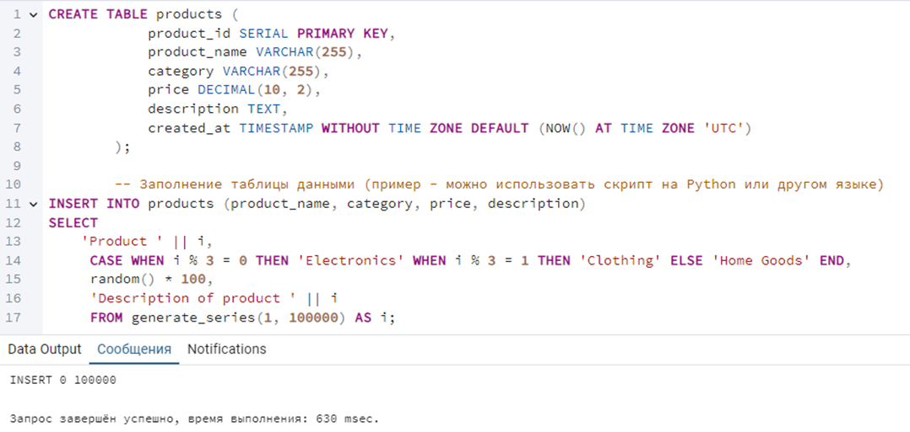
</div>

> 📗 Таблица должна содержать достаточно большое количество данных (минимум 100 000 строк), чтобы разница в производительности запросов с индексами и без индексов была заметна.

<br>

Убедимся, что в таблице действительно создалось 100 000 записей, выполнив запрос на подсчет количества строк.

<div align=center>
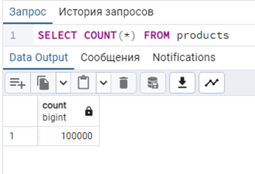
</div>

<br>

### B-tree

Создайте **B-tree** индекс для столбца product_name таблицы products.

<div align=center>
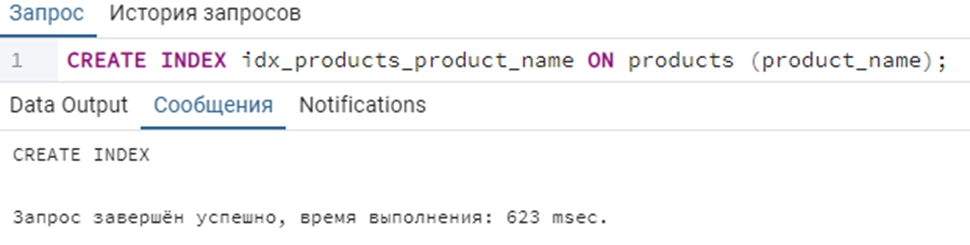
</div>

<br>

**Убедитесь, что индекс создался.**

<div align=center>
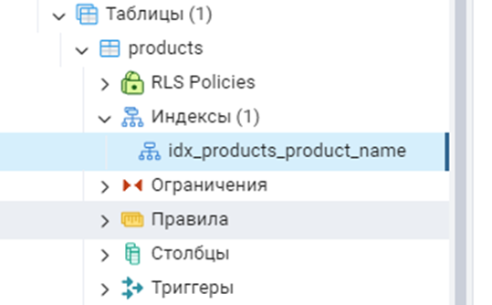
</div>

<br>

### Hash

Создайте Hash индекс для столбца category таблицы products

<div align=center>
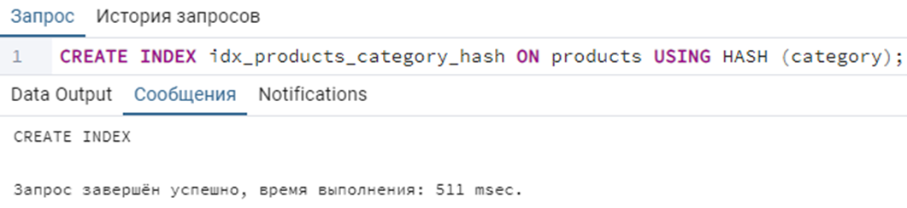
</div>

**Убедитесь, что индекс создался.**

<br>

### GiST

Создайте GiST индекс для столбца description таблицы products

<div align=center>
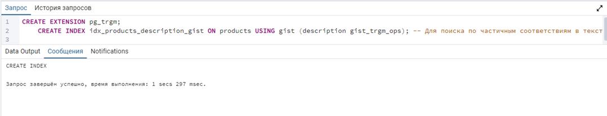
</div>

**Убедитесь, что индекс создался.**

<br>


### GIN

Создайте GIN индекс для столбца description таблицы products

<div align=center>
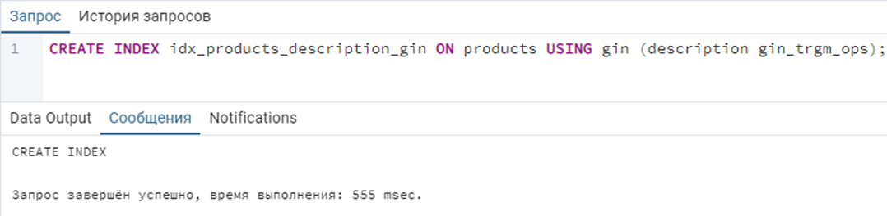
</div>

**Убедитесь, что индекс создался.**

<br>


### SP-GiST

Создание SP-GiST индекса для текстового столбца description **не имеет** особого смысла. 

**Пример (для демонстрации синтаксиса, но не применимо к текстовому полю):** допустим у нас есть столбец location типа point. 

```SQL
CREATE INDEX idx_products_location_spgist ON products USING spgist (location);
```

<br>

### BRIN

Создайте BRIN (Block Range Index) индекс для столбца created_at таблицы products

<div align=center>
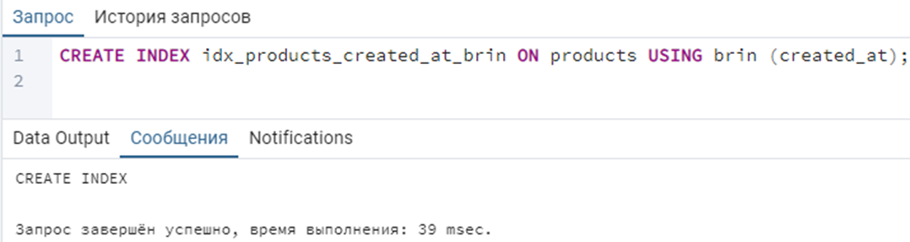
</div>

**Убедитесь, что индекс создался.** 


В итоге должно получиться 5 индексов в таблице 
<div align=center>
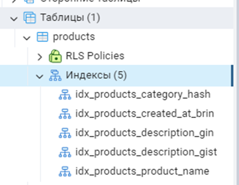
</div>

> **Выполните несколько запросов к таблице products, не использующих столбцы, по которым созданы индексы. Запишите время выполнения каждого запроса.**

<br>

Запрос по первичному ключу (будет быстрым даже без индекса).
<div align=center>
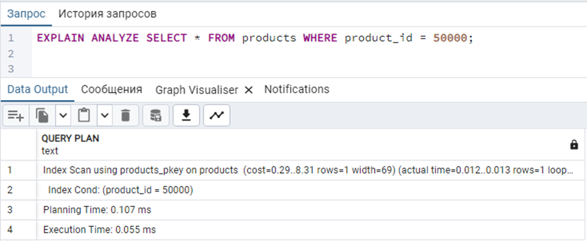
</div>

<br>

Запрос по столбцу без индекса (изначально).
<div align=center>
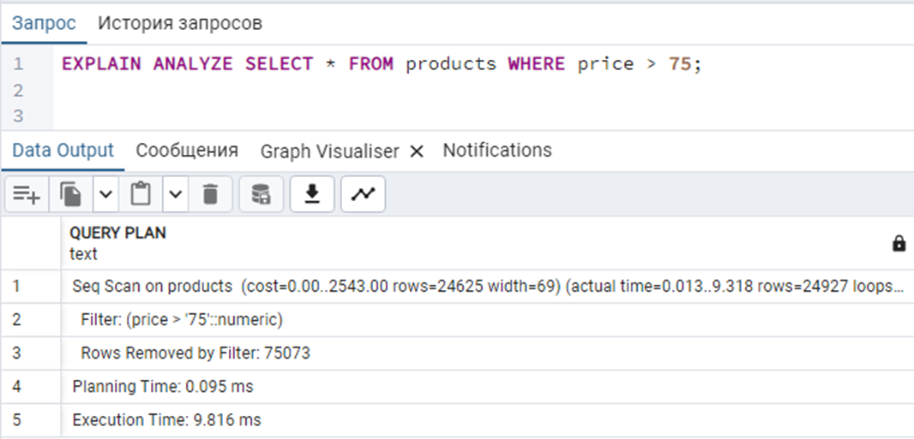
</div>

<br>

> 📗 План запроса показывает, что для выполнения запроса использовался последовательный просмотр (полный скан) всей таблицы `"products"`, что является не самым эффективным способом. Отсутствие индекса на столбце `"price"` приводит к тому, что база данных вынуждена просмотреть все строки, чтобы отфильтровать нужные.

<br>

### Анализ

1.	**Seq Scan on products (Последовательный просмотр таблицы "products"):**
1.1.	База данных просматривает каждую строку в таблице "products".
1.2.	cost=0.00..2543.00: Ориентировочная стоимость этой операции (в абстрактных единицах) — от 0 до 2543. Чем выше стоимость, тем больше ресурсов требуется.
1.3.	rows=24625: Оценка количества строк, которые вернет эта операция (первоначальная оценка количества строк в таблице) - 24625.
1.4.	width=69: Примерная ширина каждой строки (в байтах) - 69 байт.
1.5.	(actual time=0.013..9.318): Фактическое время выполнения этой операции - от 0.013 миллисекунд до 9.318 миллисекунд.
1.6.	rows=24927: Фактическое количество строк, которые были прочитаны при просмотре таблицы - 24927.

2.	**Filter: (price > '75'::numeric) (Фильтр: (цена > 75 (как число))):**
2.1.	После просмотра каждой строки, строки отфильтровываются.  В данном случае, остаются только те, у которых значение в столбце "price" больше 75.

3.	**Rows Removed by Filter: 75073 (Строк удалено фильтром: 75073):**
3.1.	Фильтр удалил 75073 строки. Это означает, что из общего количества строк таблицы, 75073 строки имели значение "price" меньше или равное 75.

4.	**Planning Time: 0.095 ms (Время планирования: 0.095 миллисекунд):**
4.1.	Базе данных потребовалось 0.095 миллисекунд для того, чтобы построить план выполнения запроса.

5.	**Execution Time: 9.816 ms (Время выполнения: 9.816 миллисекунд):**
5.1.	Общее время выполнения всего запроса составило 9.816 миллисекунд.
Выполните аналогичные запросы, использующие столбцы, по которым созданы индексы. Запишите время выполнения каждого запроса.

<br>

<div align=center>
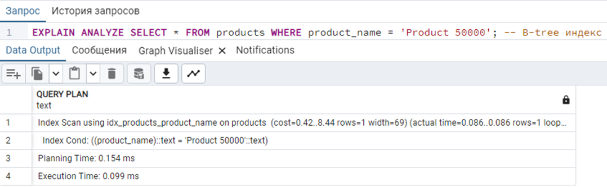
</div>

> Анализ запроса по индексу B-tree

<br>

<div align=center>
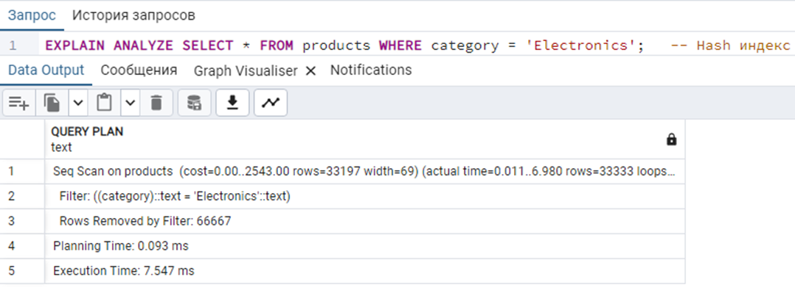
</div>

> Анализ запроса по индексу Hash

<br>

<div align=center>
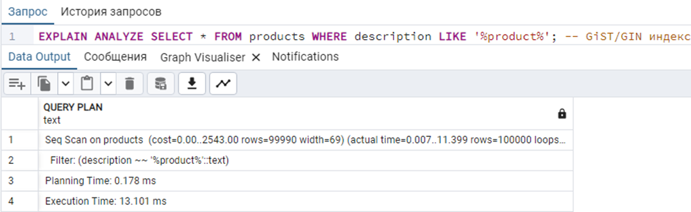
</div>

> Анализ запроса по индексу Gist/GIN

<br>

<div align=center>
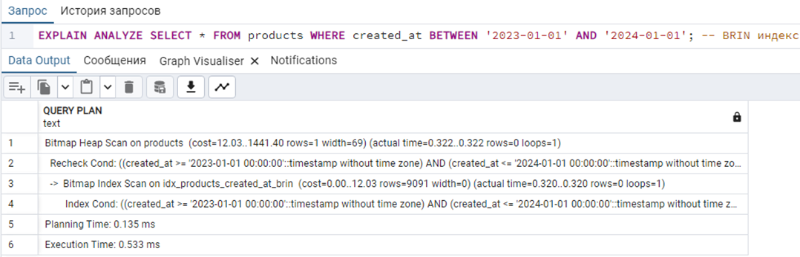
</div>

> Анализ запроса по индексу BRIN

<br>


> **Сравните время выполнения запросов с использованием и без использования индексов. Оцените влияние каждого типа индекса на производительность запросов.**

<br>

Используйте системное представление pg_stat_all_indexes для получения информации об использовании индексов. Это представление содержит статистику о количестве чтений индекса и таблицы.

**Проанализируйте статистику использования индексов. Обратите внимание на индексы, которые используются редко или не используются вообще. Если индекс занимает много места, но не используется, рассмотрите возможность его удаления, но пока что не удаляйте.**

<div align=center>
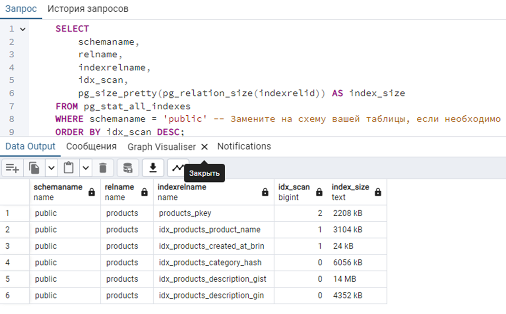
</div>

### Оптимизация индексов

Самостоятельно оптимизируйте существующие индексы (обратите внимание, что ниже представлены только примеры). 

**Необходимо на основе Вашего анализа выполнить оптимизацию:**

1.	**Удалите индексы, которые не используются или используются очень редко** (на основе анализа статистики из pg_stat_all_indexes). DROP INDEX idx_products_category_hash; -- Пример удаления Hash индекса.
2.	**Пересоздайте индексы, которые были повреждены или фрагментированы.** Это может улучшить производительность запросов. REINDEX INDEX idx_products_product_name; --Пример пересоздания индекса.
3.	**Создайте индекс на основе выражения**, чтобы оптимизировать запросы, использующие это выражение. Например, для поиска товаров по имени в нижнем регистре.

<div align=center>
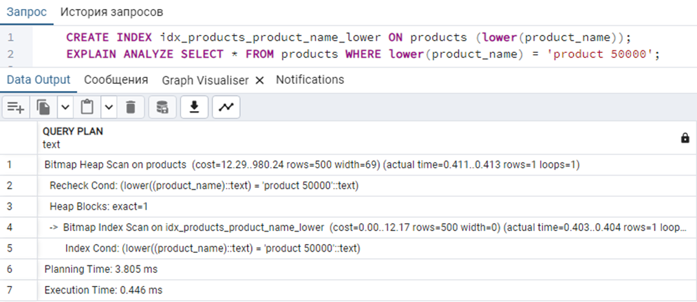
</div>

<br>

4.	**Создайте многоколоночный индекс**, если часто выполняете запросы, использующие несколько столбцов в условии WHERE. Порядок столбцов в многоколоночном индексе важен.

<div align=center>
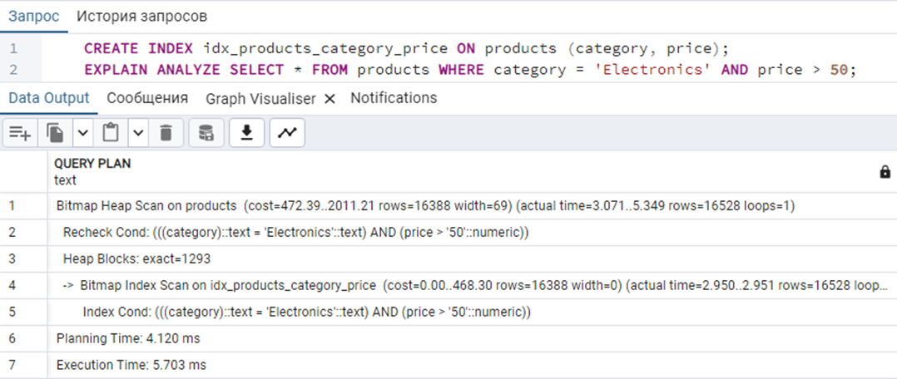
</div>

<br>

5.	**Создайте индекс только для части таблицы, удовлетворяющей определенному условию.** Это может быть полезно, если запросы часто фильтруются по определенному значению.

<div align=center>

</div>

<br>

6.	**После создания или изменения индексов, выполните команду ANALYZE для обновления статистики** о распределении данных в таблице. Это позволит оптимизатору запросов принимать более эффективные решения.

<div align=center>
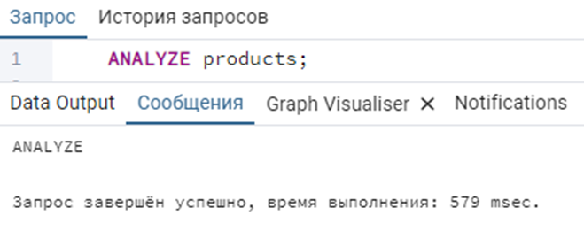
</div>

> **Самостоятельное задание: оптимизируйте работу базы данных «Склад» с помощью создания индексов и различных манипуляций с ними. Проведите анализ производительности.**

> ❗ **После выполнения самостоятельного задания, удалите базу данных indexes_lab.**
