<h1 align=center>ПРЕДСТАВЛЕНИЯ</h1>

План работы:
1.	Создание, изменение и удаление представлений.
2.	Использование представлений для упрощения сложных запросов.
3.	Материализованные представления.
4.	Права доступа к представлениям.

## Стандартные представления

***Представления (Views)** в базах данных – это **виртуальные таблицы**, основанные на результатах запроса к одной или нескольким физическим таблицам. Представления не хранят данные сами по себе; вместо этого, они содержат SQL-запрос, который выполняется каждый раз при обращении к представлению. Они служат удобным инструментом для упрощения сложных запросов, обеспечения безопасности данных и повышения гибкости структуры базы данных.*

### Синтаксис

Команда `CREATE VIEW` используется для **создания** нового представления. 

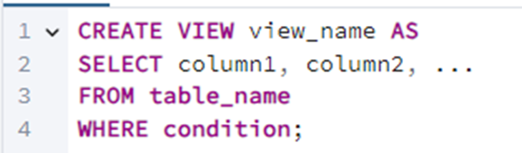

- **view_name:** Имя создаваемого представления.
- **SELECT column1, column2, ...:** Запрос, определяющий столбцы и данные, которые будут доступны через представление.
- **FROM table_name:** Таблица или таблицы, из которых берутся данные.
- **WHERE condition:** (Необязательно) Условие, фильтрующее данные, отображаемые в представлении.

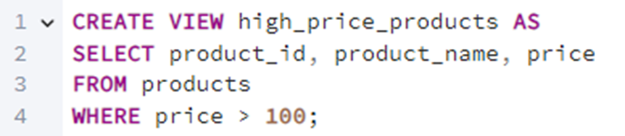

> 📗 Пример использования команды `CREATE VIEW`

Это создаст представление `high_price_products`, которое отображает только товары из таблицы `products`, у которых цена больше 100.

 

Команда `ALTER VIEW` используется для **изменения** существующего представления. 
По сути, это замена определения запроса, на котором основано представление. В большинстве СУБД синтаксис подразумевает замену текущего определения на новое.

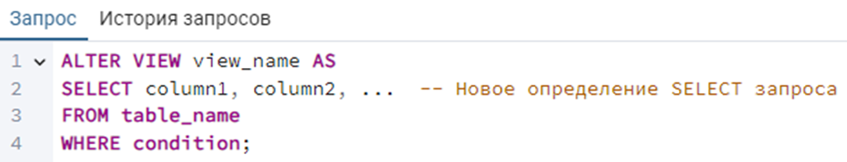

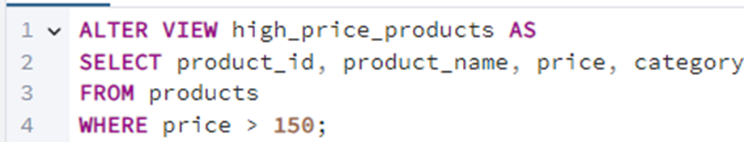

> 📗 Cинтаксис и пример запроса

Это изменит определение представления `high_price_products`, добавив столбец `category` и изменив условие фильтрации цены на "больше 150".

 

Команда `DROP VIEW` используется для **удаления** существующего представления. 

### Преимущества

Представления могут значительно **упростить сложные запросы**, разбив их на более логичные и управляемые части.

Преимущества:
1.	**Упрощение сложных запросов:** Представления позволяют скрыть сложность запросов, представляя данные в удобном и понятном виде.
2.	**Повторное использование кода:** Определение сложного запроса можно сохранить в виде представления и использовать его многократно в разных запросах.
3.	**Абстракция данных:** Представления позволяют скрыть детали структуры таблицы, предоставляя пользователям только необходимые данные.
4.	**Согласованность:** Представления гарантируют, что все пользователи будут использовать один и тот же запрос для получения определенного набора данных.

## Материализованные представления

***Материализованные представления (Materialized Views)** – это физические таблицы, хранящие результат выполнения запроса. Данные в материализованных представлениях не обновляются автоматически при изменении данных в базовых таблицах; их нужно обновлять вручную или по расписанию.*

### Синтаксис

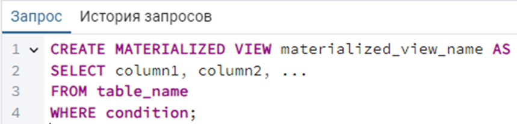

> Создание материализованного представления

 

> Обновление материализованного представления

 

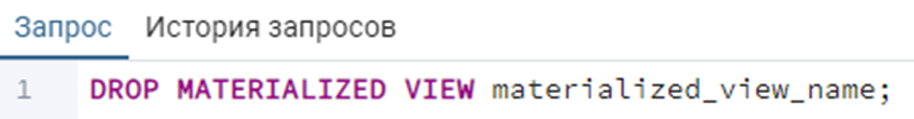

> Удаление материализованного представления

### Преимущества

1.	**Ускорение сложных запросов:** значительно ускоряют выполнение сложных запросов, особенно если базовые таблицы часто меняются, а данные в представлении не требуют немедленного обновления.
2.	**Снижение нагрузки на базу данных:** снижают нагрузку на базу данных, так как сложные вычисления выполняются заранее и сохраняются в материализованном представлении.
3.	**Поддержка исторических данных:** можно использовать для хранения исторических данных или результатов агрегации данных за определенный период.

### Случаи использования

Когда использовать материализованные представления:
1.	Когда требуется **значительно ускорить** выполнение сложных запросов, которые не требуют немедленного обновления данных.
2.	Когда необходимо **хранить** исторические данные или результаты агрегации данных.
3.	Когда **нагрузка** на базу данных должна быть **снижена**.

## Права доступа представлений

Как и к обычным таблицам, к представлениям **можно** применять права доступа, чтобы контролировать, кто может читать и изменять данные через представление.

Основные права доступа:

-	**SELECT:** Право на чтение данных из представления;
-	**INSERT:** Право на вставку данных через представление (если представление позволяет это);
-	**UPDATE:** Право на обновление данных через представление (если представление позволяет это);
-	**DELETE:** Право на удаление данных через представление (если представление позволяет это);
-	**REFERENCES:** Право на создание внешнего ключа, ссылающегося на представление;
-	**TRIGGER:** Право на создание триггеров для представления.
  

Команда **GRANT** используется для предоставления прав доступа к представлению. 

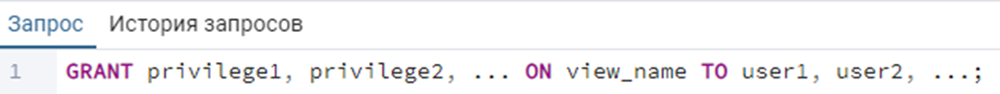

 

В свою очередь команда **REVOKE** используется для отзыва прав доступа к представлению. 

### Важно

Важные замечания о правах доступа:

1.	Права доступа к представлению не обязательно совпадают с правами доступа к базовым таблицам.
2.	Представления могут использоваться для ограничения доступа к определенным столбцам или строкам таблицы.
3.	При предоставлении прав на изменение данных через представление (INSERT, UPDATE, DELETE) необходимо убедиться, что представление является обновляемым (updatable).
4.	Для материализованных представлений обычно предоставляют только право SELECT, так как изменение данных производится путем обновления самого представления.

## Практика

Создайте тестовую базу данных `views_lab` и несколько таблиц, которые будут использоваться для создания представлений. 
Таблицы должны содержать достаточное количество данных, чтобы продемонстрировать полезность использования представлений.

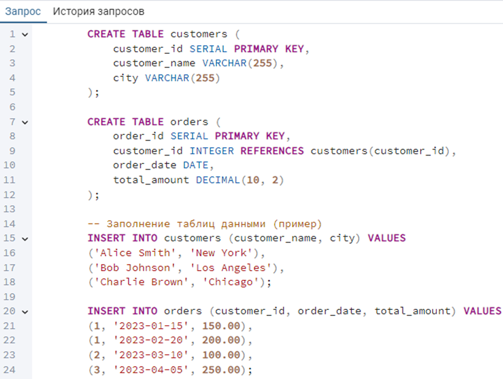

 

### Представления

Создайте представление `customer_names` на основе таблицы customers, которое отображает только `customer_id` и `customer_name`.

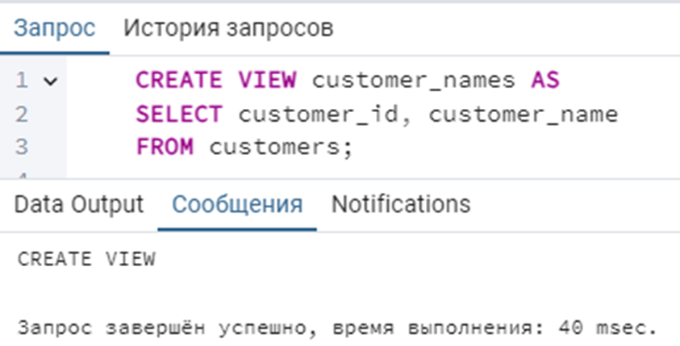

 

- **Создайте** представление ``new_york_customers``, которое отображает клиентов из таблицы `customers`, проживающих в городе **"New York"**.

- **Создайте** представление `customer_order_details`, которое объединяет информацию о клиентах из таблицы `customers` и заказах из таблицы `orders` и отображает `customer_name`, `order_date` и `total_amount` (**используйте JOIN**).

- **Измените** представление `customer_names` так, чтобы оно также отображало столбец `city`.

- **Удалите** представление `new_york_customers`.

- **Создайте** представление `customer_order_summary`, которое для каждого клиента вычисляет общее количество заказов и общую сумму заказов.

- **Используйте** представление `customer_order_summary` для получения списка клиентов, у которых общая сумма заказов превышает 300 (**используйте SELECT**).

- **Создайте** представление `top_customers`, которое основано на представлении `customer_order_summary` и отображает только 3 клиентов с наибольшей общей суммой заказов.

 

### Материализованные представления

Создайте материализованное представление `monthly_sales`, которое вычисляет общую сумму продаж за каждый месяц.

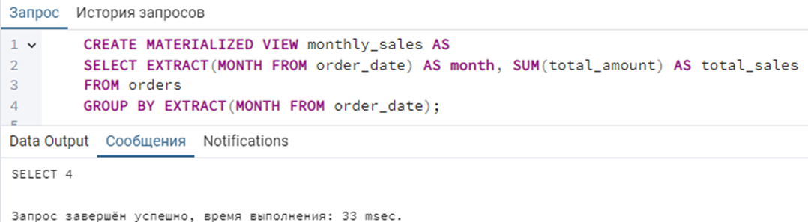

 

- **Выполните запрос** к материализованному представлению `monthly_sales` для просмотра данных.

- **Добавьте** новые данные в таблицу `orders` и обновите материализованное представление `monthly_sales`.

- **Сравните** время выполнения запроса, вычисляющего общую сумму продаж за каждый месяц непосредственно из таблицы `orders` и из материализованного представления `monthly_sales`. **Используйте EXPLAIN ANALYZE**.

### Предоставление прав

Создадим нового пользователя **test_user** с паролем «**123**».

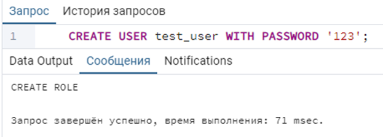

 

- **Предоставьте** пользователю `test_user` право **SELECT** на представление `customer_names`.

- **Отзовите** у пользователя `test_user` право **SELECT** на представление `customer_names`.

- **Самостоятельно создайте** 8 любых представлений для базы данных `«Склад»` из которых 3 - материализованные.

> ❗ **После выполнения самостоятельного задания, удалите базу данных views_lab и «Склад».**
